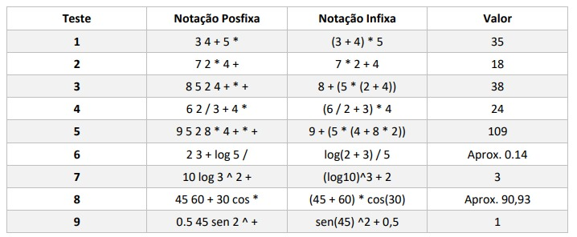
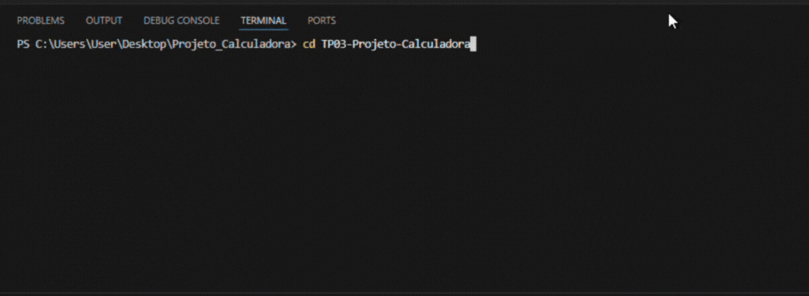

# TP03-Projeto-Calculadora
Este projeto implementa um avaliador de expressões **pós-fixas** (RPN) em linguagem C, capaz de:

- Converter expressões em **notação pós-fixa → infixa**
- Avaliar expressões pós-fixas e calcular seu **valor numérico**
- Suportar funções matemáticas como `sen`, `cos`, `tg`, `raiz` e `log`
- Considerar ângulos em **graus**
- Lidar corretamente com precedência de operadores e parênteses

Este repositório contém um código limpo e modular que pode ser reutilizado em calculadoras, interpretadores ou aulas de estrutura de dados com pilhas.

---

## 📁 Estrutura do Projeto

<pre>
├── expressao.c # Implementação das funções de conversão e avaliação
├── expressao.h # Interface do módulo
├── main.c # Exemplo simples de uso
└── README.md
</pre>

---

## 🧪 Tabela de Testes Utilizados

<p align="center">
  
</p>

---

## ▶️ Exemplo de uso (main.c)

```bash
POS-FIXA > 3 4 + 5 *

Infixa : (3+4)*5
Valor : 35.000000
```

Para encerrar:
```bash
POS-FIXA > sair
```

<p align="center">
  
</p>

---

## 🔧 Como Compilar

No Linux, macOS ou Windows (MinGW):
```bash
gcc expressao.c main.c -o expressao.exe -lm
```

Rodar:
```bash
./expressao
``` 

>   O parâmetro -lm é obrigatório para usar <math.h>.  
